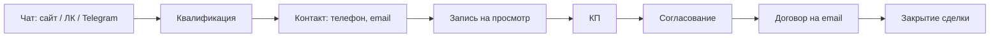
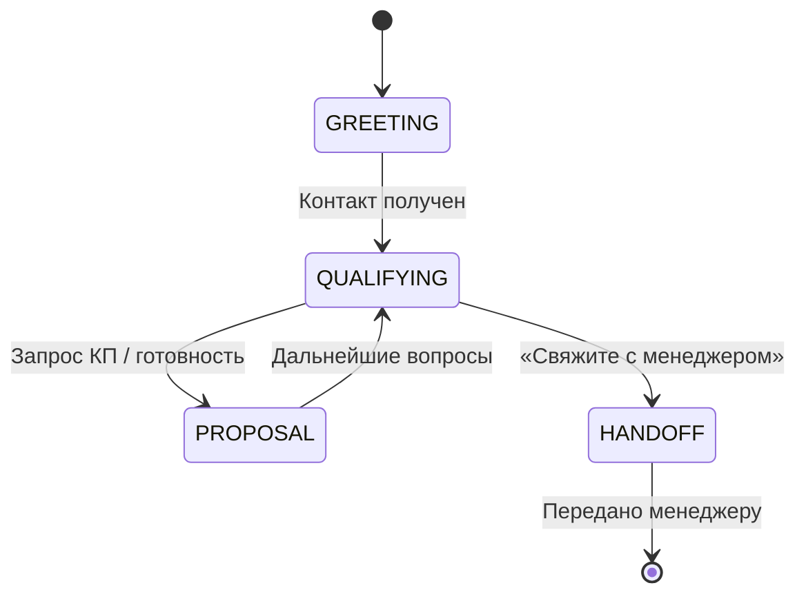

# Бизнес-процессы: воронка, каналы, AmoCRM и KB

Краткое описание потоков данных и ролей компонентов в соответствии с реальной реализацией (n8n, amocrm-api, funnel-api, kb-service, личный кабинет).

---

## 1. Воронка продаж (от контакта до закрытия сделки)

- **Источники лида:** сайт (виджет чата), личный кабинет (ЛК), Telegram, Avito. Все сообщения приходят в **n8n webhook** `POST /webhook/sales-agent-kb`.
- **Контакт:** при передаче телефона (и по возможности email) n8n вызывает **amocrm-api** `POST /api/test-lead-from-chat` → создаётся контакт и сделка в AmoCRM, запись в **conversations** (PostgreSQL), при необходимости — пользователь ЛК (логин/пароль для входа в кабинет).
- **Запись на просмотр:** слоты 9–18 из **funnel-api** (`/api/viewing-slots/available`, `/api/viewing-slots/book`); после брони — задача/примечание в AmoCRM для менеджера.
- **КП и договор:** создание КП — funnel-api `POST /api/proposals`; выдача договора — шаблоны `document_templates` (type=contract); подготовка письма с договором — `POST /api/contracts/prepare-email`; отправка письма — n8n (Send Email) или внешний сервис.
- **Закрытие сделки:** amocrm-api `POST /api/leads/{id}/close` (перевод в этап «Успешно реализовано»).

Подробный сценарий «повторный заход → КП → договор → email → закрытие»: [SCENARIO_REPEAT_VISIT_CP_CONTRACT.md](./SCENARIO_REPEAT_VISIT_CP_CONTRACT.md). Календарь и API: [FUNNEL_CALENDAR_CP_CONTRACT.md](./FUNNEL_CALENDAR_CP_CONTRACT.md).

---

## 2. FSM нейропродажника и handoff

- **Состояния** хранятся в `conversations.state`. После создания лида из чата — `QUALIFYING`. При явном запросе «менеджер», «оператор» — переход в **HANDOFF**: обновление state, создание задачи в AmoCRM, примечание с резюме диалога.
- **Возврат диалога агенту:** менеджер может перевести state обратно (например в PROPOSAL) через `PATCH /api/conversation/{id}/state` или `POST /api/conversation/{id}/return-to-agent` — тогда при следующем сообщении клиента агент продолжит (досыл КП, договор).

---

## 3. Роль n8n и цепочка обработки сообщения

- **Единая точка входа:** webhook `sales-agent-kb`. Тело: `message`, `channel`, `external_id` (сессия чата); для ЛК — дополнительно `conversation_id`.
- **Цепочка:** нормализация входа → **DLP** (обезличивание текста для LLM) → **Resolve Conversation** (история по external_id/conversation_id) → **KB Search** (поиск в базе знаний) → формирование промпта (воронка, слоты, медиа) → **LLM** → ответ клиенту. При наличии телефона в сообщении — **Maybe Create Lead** → `POST /api/test-lead-from-chat`. После ответа — **Save Messages** (сохранение реплик в PostgreSQL).
- **Календарь:** при запросе слотов — вызов funnel-api; при распознавании даты/времени бронирования — Book Viewing Slot.

Детали узлов и потоков: [n8n/BUSINESS_PROCESSES.md](../n8n/BUSINESS_PROCESSES.md).

---

## 4. AmoCRM и личный кабинет

- **AmoCRM:** создание контакта и сделки при передаче контакта из чата; тестовые объекты — префикс `[BRATS-TEST]`, тег `brats_test`. Закрытие сделки — `POST /api/leads/{id}/close`. Сообщение менеджера в чат: либо отдельная вкладка «Чат менеджера» (наш интерфейс по conversation_id), либо примечание к сделке → webhook AmoCRM → наша обработка (при наличии тарифа и публичного URL).
- **Личный кабинет (ЛК):** при создании контакта из чата создаётся пользователь ЛК (логин = email или телефон, пароль = телефон). Клиенту в чате можно передать ссылку на вход и учётные данные. После входа в ЛК — чат с тем же агентом (тот же диалог, КП, договор, детали ремонта и обустройства).

Сводка по API и настройке: [AMOCRM.md](./AMOCRM.md). OAuth2: [AMOCRM_API_SETUP.md](./AMOCRM_API_SETUP.md). ЛК: [PERSONAL_CABINET_LK.md](./PERSONAL_CABINET_LK.md).

---

## 5. База знаний (KB)

- **Назначение:** дать агенту точные данные о продукте (дома, цены, условия), скрипты продаж, обработку возражений, контакты и процедуры. Хранение — PostgreSQL (pgvector), таблица `knowledge_base`; метаданные (категория, аудитория, медиа) — JSONB.
- **В потоке:** n8n вызывает kb-service `POST /api/kb/search` по обезличенному сообщению; результаты подставляются в промпт LLM. Медиа (images/documents) из metadata возвращаются в ответе чату для отображения.
- **Категории:** product_info, sales_script, objection_handling, contacts, pricing, location, tone_of_voice. Загрузка — скрипты из `data/`, импорт через API/админку.

Структура и рекомендации: [KB.md](./KB.md). Концепция и медиа: [CONCEPT.md](./CONCEPT.md).

---

## 6. Связь документов

| Тема | Документ |
|------|----------|
| Концепция KB, воронка, медиа | [CONCEPT.md](./CONCEPT.md) |
| AmoCRM: API, ЛК, webhook | [AMOCRM.md](./AMOCRM.md) |
| AmoCRM: OAuth2 | [AMOCRM_API_SETUP.md](./AMOCRM_API_SETUP.md) |
| Календарь, КП, договор, handoff | [FUNNEL_CALENDAR_CP_CONTRACT.md](./FUNNEL_CALENDAR_CP_CONTRACT.md) |
| Сценарий до закрытия сделки | [SCENARIO_REPEAT_VISIT_CP_CONTRACT.md](./SCENARIO_REPEAT_VISIT_CP_CONTRACT.md) |
| n8n: узлы и потоки | [n8n/BUSINESS_PROCESSES.md](../n8n/BUSINESS_PROCESSES.md) |
| База знаний | [KB.md](./KB.md) |
| Личный кабинет | [PERSONAL_CABINET_LK.md](./PERSONAL_CABINET_LK.md) |
