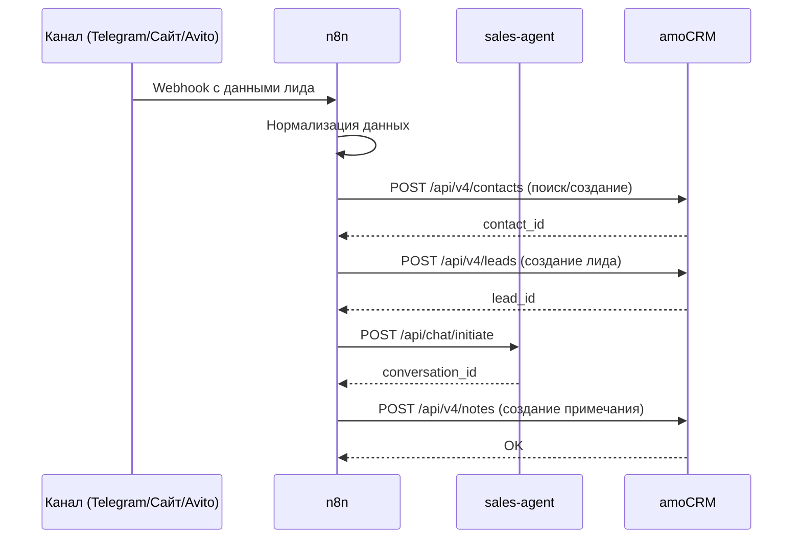
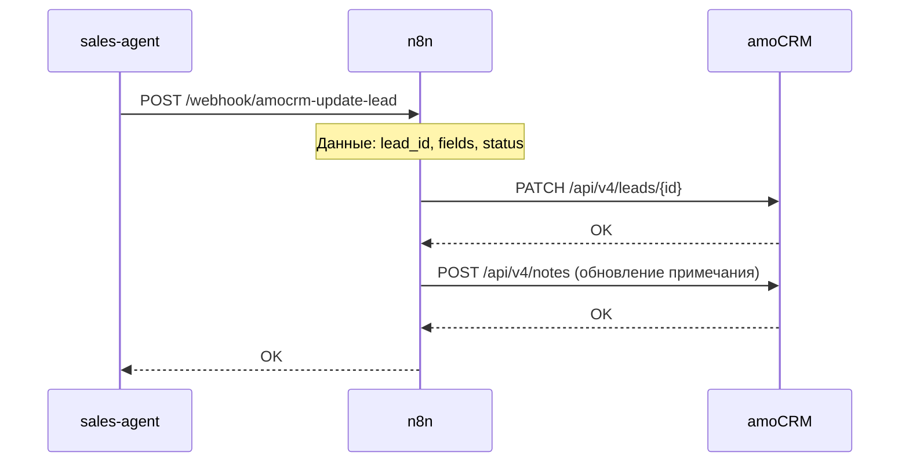
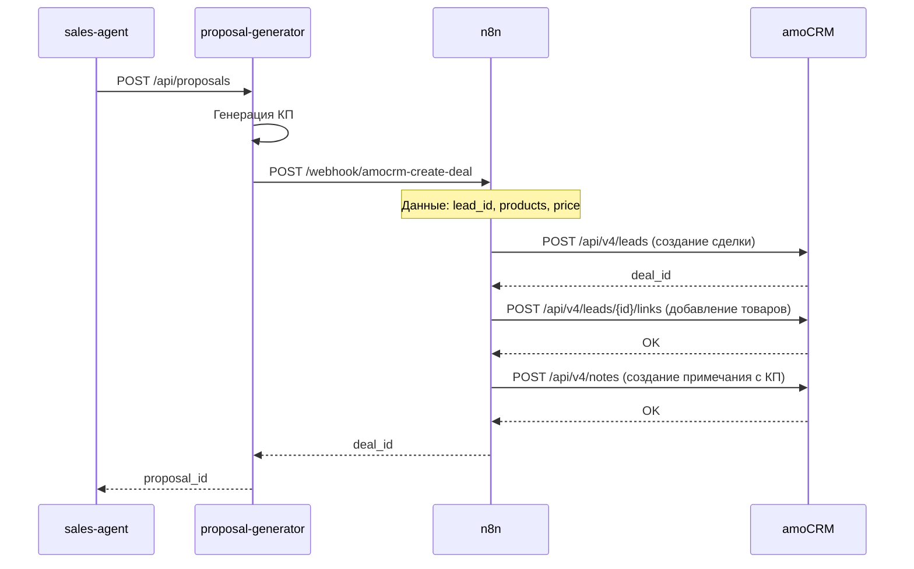
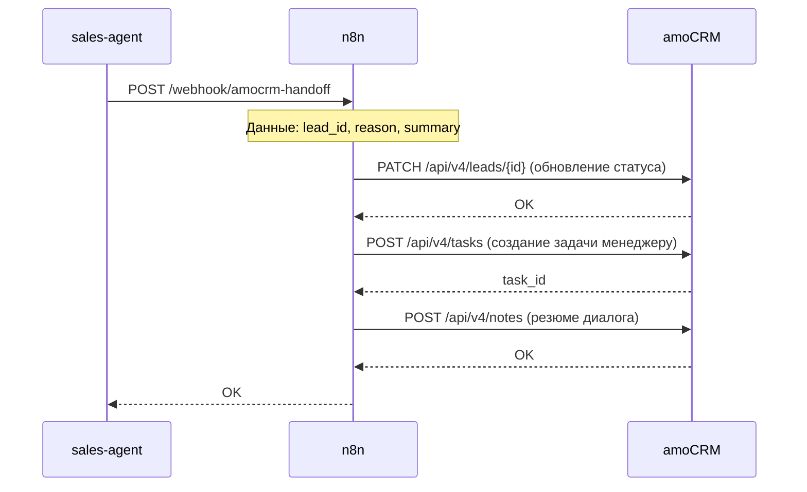
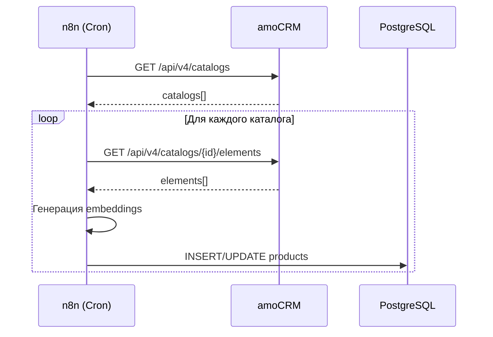

# Архитектура интеграции с amoCRM

## Обзор

Данный документ описывает архитектуру интеграции системы нейропродажника с amoCRM. Интеграция реализована через n8n как центральный оркестратор, обеспечивающий гибкость и масштабируемость системы.

**Версия:** v0.1  
**Дата обновления:** 2026-02-08

---

## Архитектурные принципы

### 1. Централизованная оркестрация через n8n

- **n8n** выступает единой точкой интеграции с amoCRM
- Все сервисы взаимодействуют с amoCRM через n8n workflows
- Упрощает управление токенами, обработку ошибок и логирование

### 2. Разделение ответственности

- **sales-agent** — бизнес-логика диалогов и квалификации
- **sales-analytic** — анализ данных и триггеры
- **proposal-generator** — генерация КП и договоров
- **n8n** — оркестрация и интеграция с amoCRM

### 3. Асинхронная обработка

- Все операции с amoCRM выполняются асинхронно
- Использование очередей для критических операций
- Retry механизмы для обработки временных ошибок

---

## Компоненты системы

### 1. n8n (Оркестратор)

**Роль:** Центральный оркестратор всех интеграций с amoCRM

**Функции:**
- Управление OAuth2 токенами amoCRM
- Создание и обновление лидов, контактов, сделок
- Синхронизация каталога товаров
- Обработка webhook'ов от amoCRM
- Маршрутизация событий между сервисами

**Workflows:**
- `amocrm-create-lead` — создание лида
- `amocrm-update-lead` — обновление лида
- `amocrm-create-note` — создание примечания
- `amocrm-create-task` — создание задачи
- `amocrm-sync-catalog` — синхронизация каталога
- `amocrm-webhook-handler` — обработка webhook'ов

### 2. sales-agent (Нейропродажник)

**Роль:** Ведение диалогов с лидами, квалификация, генерация КП

**Интеграция с amoCRM:**
- Получение данных о лиде из amoCRM через n8n
- Запрос на создание/обновление лида через n8n webhook
- Запрос на создание примечаний с резюме диалога
- Запрос на создание задач менеджеру при handoff

**API Endpoints:**
- `POST /api/chat/initiate` — инициация диалога
- `POST /api/chat/message` — обработка сообщения
- `POST /api/conversation/{id}/handoff` — передача менеджеру

### 3. sales-analytic (Нейроаналитик)

**Роль:** Анализ поведения посетителей, определение горячих лидов

**Интеграция с amoCRM:**
- Создание лидов на основе аналитики через n8n
- Обновление меток лидов (источник, сегмент, поведение)
- Синхронизация данных о конверсиях

**API Endpoints:**
- `POST /api/analytics/trigger` — триггер для создания лида
- `GET /api/analytics/conversion` — анализ конверсии

### 4. proposal-generator (Генератор КП)

**Роль:** Генерация и модификация коммерческих предложений

**Интеграция с amoCRM:**
- Создание сделок с товарами из каталога
- Синхронизация КП с примечаниями в amoCRM
- Обновление статусов сделок
- Создание документов (КП, договоры)

**API Endpoints:**
- `POST /api/proposals` — создание КП
- `POST /api/proposals/{id}/modify` — модификация КП
- `POST /api/contracts` — создание договора

### 5. kb-service (База знаний)

**Роль:** Хранение и поиск информации для агента

**Интеграция с amoCRM:**
- Обогащение KB данными из примечаний менеджеров
- Использование данных о лидах для улучшения ответов

---

## Потоки данных

### Поток 1: Создание лида из канала



### Поток 2: Обновление лида в процессе диалога



### Поток 3: Создание КП и сделки



### Поток 4: Handoff менеджеру



### Поток 5: Синхронизация каталога



---

## API Endpoints n8n для работы с amoCRM

### Webhook Endpoints

Все сервисы обращаются к n8n через webhook endpoints:

#### 1. Создание лида

```
POST http://n8n:5678/webhook/amocrm-create-lead
```

**Payload:**
```json
{
  "contact": {
    "name": "Иван Иванов",
    "phone": "+79991234567",
    "email": "ivan@example.com"
  },
  "lead": {
    "name": "Лид с сайта",
    "price": 0,
    "pipeline_id": 12345,
    "status_id": 123456
  },
  "metadata": {
    "source": "site",
    "visitor_id": "visitor_123",
    "session_id": "session_456"
  }
}
```

**Response:**
```json
{
  "lead_id": 789012,
  "contact_id": 345678,
  "status": "created"
}
```

#### 2. Обновление лида

```
POST http://n8n:5678/webhook/amocrm-update-lead
```

**Payload:**
```json
{
  "lead_id": 789012,
  "fields": {
    "price": 8350000,
    "custom_fields": [
      {
        "field_id": 123456,
        "values": [{"value": "Готов к КП"}]
      }
    ]
  },
  "status_id": 123457
}
```

#### 3. Создание примечания

```
POST http://n8n:5678/webhook/amocrm-create-note
```

**Payload:**
```json
{
  "lead_id": 789012,
  "note_type": "common",
  "text": "Резюме диалога с нейропродажником:\n- Клиент интересуется BLACK BOX\n- Бюджет до 10 млн\n- Готов к просмотру"
}
```

#### 4. Создание задачи

```
POST http://n8n:5678/webhook/amocrm-create-task
```

**Payload:**
```json
{
  "lead_id": 789012,
  "task_type": "call",
  "text": "Связаться с клиентом для уточнения деталей",
  "complete_till": 1736946000,
  "responsible_user_id": 12345
}
```

#### 5. Создание сделки с товарами

```
POST http://n8n:5678/webhook/amocrm-create-deal
```

**Payload:**
```json
{
  "lead_id": 789012,
  "name": "КП #123",
  "price": 8350000,
  "catalog_items": [
    {
      "catalog_id": 100,
      "element_id": 200,
      "quantity": 1,
      "price": 8350000
    }
  ]
}
```

#### 6. Синхронизация каталога

```
POST http://n8n:5678/webhook/amocrm-sync-catalog
```

**Payload:**
```json
{
  "catalog_id": 100,
  "force": false
}
```

---

## Управление токенами OAuth2

### Хранение токенов

Токены хранятся в n8n credentials:
- **Access Token** — для API запросов (срок жизни ~24 часа)
- **Refresh Token** — для обновления Access Token (срок жизни ~30 дней)
- **Subdomain** — поддомен amoCRM
- **Client ID** и **Client Secret** — для обновления токенов

### Автоматическое обновление

n8n автоматически обновляет токены:
1. Проверка срока действия Access Token перед каждым запросом
2. Если токен истекает в течение 5 минут — автоматическое обновление
3. Использование Refresh Token для получения нового Access Token
4. Обновление credentials в n8n

### Обработка ошибок

- **401 Unauthorized** — автоматическое обновление токена и повтор запроса
- **429 Too Many Requests** — retry с exponential backoff
- **500/502/503** — retry с задержкой

---

## Схема данных

### Связь между сущностями

```
conversations (PostgreSQL)
  ├── amocrm_lead_id → leads (amoCRM)
  └── amocrm_contact_id → contacts (amoCRM)

proposals (PostgreSQL)
  ├── conversation_id → conversations
  └── amocrm_lead_id → leads (amoCRM)

products (PostgreSQL)
  └── amocrm_catalog_id → catalog elements (amoCRM)

analytics_events (PostgreSQL)
  └── visitor_id → может быть связан с contact (amoCRM) после деанонимизации
```

### Маппинг полей

#### Лид (Lead)

| PostgreSQL (conversations) | amoCRM (leads) | Описание |
|---------------------------|----------------|----------|
| `amocrm_lead_id` | `id` | ID лида в amoCRM |
| `channel` | `custom_fields.source` | Источник лида |
| `status` | `status_id` | Статус в воронке |
| `created_at` | `created_at` | Дата создания |

#### Контакт (Contact)

| PostgreSQL | amoCRM (contacts) | Описание |
|------------|-------------------|----------|
| `amocrm_contact_id` | `id` | ID контакта |
| `phone` | `custom_fields.phone` | Телефон |
| `email` | `custom_fields.email` | Email |
| `name` | `name` | Имя |

#### Товар (Product)

| PostgreSQL (products) | amoCRM (catalog elements) | Описание |
|----------------------|---------------------------|----------|
| `amocrm_catalog_id` | `id` | ID товара в каталоге |
| `amocrm_sku` | `sku` | SKU товара |
| `name` | `name` | Название |
| `price_base` | `price / 100` | Цена (amoCRM в копейках) |

---

## Обработка ошибок и retry

### Стратегия retry

1. **Временные ошибки (5xx, 429)**
   - Retry с exponential backoff
   - Максимум 3 попытки
   - Задержка: 1s, 2s, 4s

2. **Ошибки авторизации (401)**
   - Автоматическое обновление токена
   - Повтор запроса
   - Если не помогло — уведомление администратора

3. **Ошибки валидации (400, 422)**
   - Логирование ошибки
   - Уведомление сервиса-инициатора
   - Без retry

### Логирование

Все операции логируются в n8n:
- Успешные запросы — INFO уровень
- Ошибки — ERROR уровень
- Retry попытки — WARN уровень

---

## Безопасность

### 1. Хранение токенов

- Токены хранятся в n8n credentials (зашифрованы)
- Не передаются в URL или логи
- Обновляются автоматически

### 2. Валидация данных

- Все данные валидируются перед отправкой в amoCRM
- Проверка формата телефонов, email
- Санитизация текстовых полей

### 3. Rate Limiting

- Соблюдение лимитов amoCRM API (7 запросов/сек)
- Очереди для batch операций
- Приоритизация критических операций

### 4. Соответствие 152-ФЗ

- Обезличивание данных перед логированием
- Хранение ПДн только в amoCRM
- Логирование только метаданных

---

## Мониторинг и метрики

### Метрики для отслеживания

1. **Производительность**
   - Время ответа amoCRM API
   - Количество успешных/неуспешных запросов
   - Количество retry попыток

2. **Бизнес-метрики**
   - Количество созданных лидов
   - Конверсия лидов в сделки
   - Среднее время обработки лида

3. **Ошибки**
   - Количество ошибок по типам
   - Время до восстановления после ошибки
   - Частота обновления токенов

### Алерты

- Критическое количество ошибок (>10% за 5 минут)
- Проблемы с обновлением токенов
- Превышение rate limits

---

## Примеры использования

### Пример 1: Создание лида из события с сайта

```python
# sales-analytic/domain/services.py
async def trigger_lead_creation(visitor_data: dict):
    """Создание лида на основе аналитики"""
    async with httpx.AsyncClient() as client:
        response = await client.post(
            "http://n8n:5678/webhook/amocrm-create-lead",
            json={
                "contact": {
                    "phone": visitor_data.get("phone"),
                    "email": visitor_data.get("email")
                },
                "lead": {
                    "name": f"Лид с сайта ({visitor_data['visitor_id']})",
                    "price": 0,
                    "pipeline_id": 12345,
                    "status_id": 123456
                },
                "metadata": {
                    "source": "site",
                    "visitor_id": visitor_data["visitor_id"],
                    "intent_score": visitor_data.get("intent_score", 0.0)
                }
            }
        )
        return response.json()
```

### Пример 2: Обновление лида после диалога

```python
# sales-agent/domain/conversation.py
async def update_lead_after_qualification(conversation_id: int, qualification_data: dict):
    """Обновление лида после квалификации"""
    conversation = await get_conversation(conversation_id)
    
    async with httpx.AsyncClient() as client:
        response = await client.post(
            "http://n8n:5678/webhook/amocrm-update-lead",
            json={
                "lead_id": conversation.amocrm_lead_id,
                "fields": {
                    "price": qualification_data.get("budget", 0),
                    "custom_fields": [
                        {
                            "field_id": 123456,  # Бюджет
                            "values": [{"value": qualification_data.get("budget")}]
                        },
                        {
                            "field_id": 123457,  # Тип отделки
                            "values": [{"value": qualification_data.get("renovation_type")}]
                        }
                    ]
                }
            }
        )
        return response.json()
```

### Пример 3: Создание КП с товарами

```python
# proposal-generator/domain/proposal.py
async def create_proposal_with_catalog(conversation_id: int, selected_products: list):
    """Создание КП с товарами из каталога"""
    conversation = await get_conversation(conversation_id)
    proposal = await generate_proposal(conversation_id, selected_products)
    
    # Добавление товаров в сделку через n8n
    async with httpx.AsyncClient() as client:
        response = await client.post(
            "http://n8n:5678/webhook/amocrm-create-deal",
            json={
                "lead_id": conversation.amocrm_lead_id,
                "name": f"КП #{proposal.id}",
                "price": proposal.total_price,
                "catalog_items": [
                    {
                        "catalog_id": 100,
                        "element_id": product["amocrm_catalog_id"],
                        "quantity": 1,
                        "price": product["price"]
                    }
                    for product in selected_products
                ]
            }
        )
        deal_data = response.json()
        
        # Обновление proposal с deal_id
        await update_proposal(proposal.id, {"amocrm_lead_id": deal_data["deal_id"]})
        
        return proposal
```

---

## Чек-лист настройки

### Настройка n8n

- [ ] Установлен и запущен n8n
- [ ] Созданы credentials для amoCRM (OAuth2)
- [ ] Настроены workflows для работы с amoCRM
- [ ] Протестированы webhook endpoints

### Настройка сервисов

- [ ] sales-agent настроен на использование n8n webhooks
- [ ] sales-analytic настроен на создание лидов через n8n
- [ ] proposal-generator настроен на создание сделок через n8n
- [ ] Все сервисы имеют доступ к n8n (сеть, DNS)

### Тестирование

- [ ] Тест создания лида из канала
- [ ] Тест обновления лида
- [ ] Тест создания КП с товарами
- [ ] Тест handoff менеджеру
- [ ] Тест синхронизации каталога
- [ ] Тест обработки ошибок и retry

---

## Полезные ссылки

- [Документация API amoCRM](https://www.amocrm.ru/developers/content/api/account)
- [OAuth2 в amoCRM](https://www.amocrm.ru/developers/content/oauth/step-by-step)
- [Настройка API доступа](./AMOCRM_API_SETUP.md)
- [Интеграция каталога](./AMOCRM_CATALOG_INTEGRATION.md)
- [n8n Documentation](https://docs.n8n.io/)

---

**Последнее обновление:** 2026-02-08

